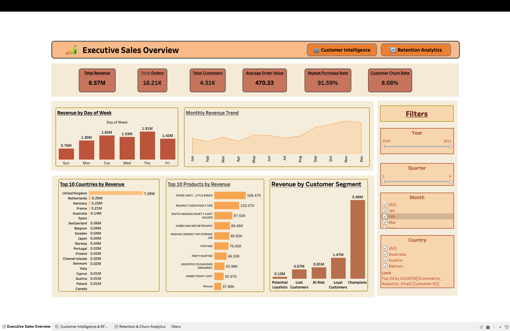
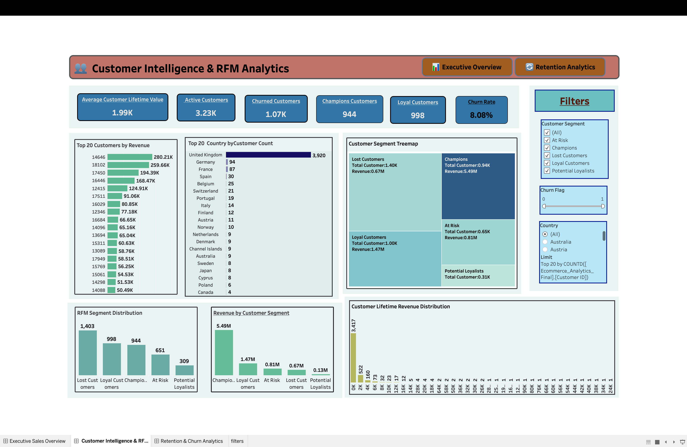
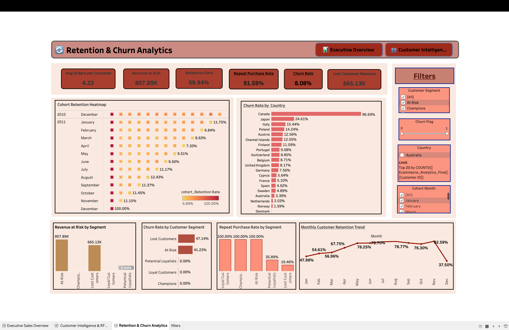

# E-Commerce Customer Retention & Revenue Intelligence Analytics

## Project Overview

This project analyzes customer purchasing behavior, sales performance, retention patterns, and churn risk using Python, SQL, and Tableau.

The objective of this project is to build an end-to-end analytics solution that transforms raw transactional data into actionable business insights.

This project covers:

- Data Cleaning
- Exploratory Data Analysis (EDA)
- Feature Engineering
- RFM Analysis
- Churn Analysis
- Cohort Retention Analysis
- Interactive Tableau Dashboards

---

## Business Objectives

- Analyze revenue trends over time
- Identify top-performing products
- Identify top revenue-generating countries
- Segment customers based on RFM analysis
- Measure customer retention and churn
- Detect revenue at risk
- Analyze repeat purchase behavior
- Validate Pareto Principle (80/20 rule)

---

## Tech Stack

### Programming & Analysis

- Python
- Pandas
- NumPy
- Matplotlib
- Seaborn

### Database

- MySQL

### Visualization

- Tableau

---

## Dataset

Dataset used: **Online Retail Dataset**

The dataset contains transactional data of an online retail store.

### Main Features

- InvoiceNo
- StockCode
- Description
- Quantity
- InvoiceDate
- UnitPrice
- CustomerID
- Country

---

## Project Workflow

### 1. Data Cleaning

Performed:

- Removed null CustomerIDs
- Removed canceled orders
- Removed negative quantity values
- Converted InvoiceDate to datetime format
- Created Revenue column

---

### 2. Feature Engineering

Created:

- Revenue
- Year
- Month
- Quarter
- Day_of_Week
- Customer_Lifetime_Revenue
- Frequency
- Recency
- Order_Count
- Churn_Flag

---

### 3. Exploratory Data Analysis (EDA)

Performed exploratory data analysis to identify patterns in customer purchasing behavior and sales performance.

#### Revenue Distribution

Analyzed the distribution of customer lifetime revenue to understand customer spending behavior.


---

#### Top 10 Products by Revenue

Identified the highest revenue-generating products.


---

#### Revenue by Country

Analyzed which countries contributed the highest revenue.


---

#### Monthly Revenue Trend

Visualized monthly revenue to identify seasonality and sales growth patterns.


---

#### Revenue by Customer Segment

Compared revenue contribution across customer segments.


---

### 4. RFM Analysis

Used RFM model for customer segmentation.

#### RFM Metrics

- Recency
- Frequency
- Monetary

#### Customer Segments

- Champions
- Loyal Customers
- Potential Loyalists
- At Risk
- Lost Customers

---

### 5. SQL Business Analysis

Performed:

- Monthly Revenue Trend
- Revenue by Country
- Average Revenue per Customer
- Repeat Purchase Rate
- Customer Churn Rate
- Running Revenue Total
- Revenue Growth Percentage
- Customer Growth Percentage
- Product Revenue Ranking
- Top Customer by Country
- Cohort Retention Analysis
- Revenue Concentration Analysis (80/20)

---

### 6. Tableau Dashboard Development

Built three interactive dashboards.

---

## Dashboard 1 — Executive Sales Overview

### KPIs

- Total Revenue
- Total Orders
- Total Customers
- Average Order Value
- Repeat Purchase Rate
- Customer Churn Rate

### Charts

- Monthly Revenue Trend
- Revenue by Day of Week
- Top 10 Countries by Revenue
- Top 10 Products by Revenue
- Revenue by Customer Segment

---

## Dashboard 1 Preview



---

## Dashboard 2 — Customer Intelligence & RFM Analytics

### KPIs

- Average Customer Lifetime Value
- Active Customers
- Churned Customers
- Champions Customers
- Loyal Customers
- Churn Rate

### Charts

- Top 20 Customers by Revenue
- Customer Count by Country
- Customer Segment Treemap
- RFM Segment Distribution
- Revenue by Customer Segment
- Customer Lifetime Revenue Distribution

---

## Dashboard 2 Preview



---

## Dashboard 3 — Retention & Churn Analytics

### KPIs

- Average Orders per Customer
- Revenue at Risk
- Retention Rate
- Repeat Purchase Rate
- Churn Rate
- Lost Customer Revenue

### Charts

- Cohort Retention Heatmap
- Churn Rate by Country
- Revenue at Risk by Segment
- Churn Rate by Customer Segment
- Repeat Purchase Rate by Segment
- Monthly Customer Retention Trend

---

## Dashboard 3 Preview



---

## Key Insights

### Revenue Insights

- Top 20% of customers generated 83% of total revenue
- United Kingdom contributed the highest revenue
- Revenue peaked during Q4 seasonality

### Customer Insights

- Champions generated the highest customer segment revenue
- Repeat purchase rate was 91.59%
- Churn rate was 8.08%

### Retention Insights

- Customer retention drops significantly after Month 3
- At-risk customers hold significant revenue potential
- Lost customers contributed over 665K in lost revenue

---

## Repository Structure

```text
├── data/
│   ├── Online_Retail.xlsx
│   ├── final_dataset.csv
│
├── notebooks/
│   ├── customer_retention_analysis.ipynb
│
├── sql/
│   ├── customer_retention_SQL_Query.sql
│
├── tableau/
│   ├── Customer Retention & Revenue Intelligence Analytics.twb
│
├── dashboards/
│   ├── Dashboard1.png
│   ├── Dashboard2.png
│   ├── Dashboard3.png
│
├── eda/
│   ├── revenue_distribution.png
│   ├── top_products.png
│   ├── revenue_by_country.png
│   ├── monthly_revenue_trend.png
│   ├── revenue_by_segment.png
│
├── README.md
```

---

## How to Run

### Install Dependencies

```bash
pip install pandas numpy matplotlib seaborn
```

### Run Python Notebook

```bash
jupyter notebook customer_retention_analysis.ipynb
```

### Run SQL File

```sql
source customer_retention_SQL_Query.sql;
```

### Open Tableau Dashboard

```text
Customer Retention & Revenue Intelligence Analytics.twb
```

---

## Skills Demonstrated

- Data Cleaning
- Exploratory Data Analysis
- Feature Engineering
- Customer Segmentation
- RFM Analysis
- Churn Analysis
- Cohort Analysis
- SQL Window Functions
- Tableau Dashboard Design
- Business Intelligence

---

## Author

Your Name

GitHub: https://github.com/yourusername  
LinkedIn: https://linkedin.com/in/yourprofile

---

If you found this project useful, feel free to star the repository.
